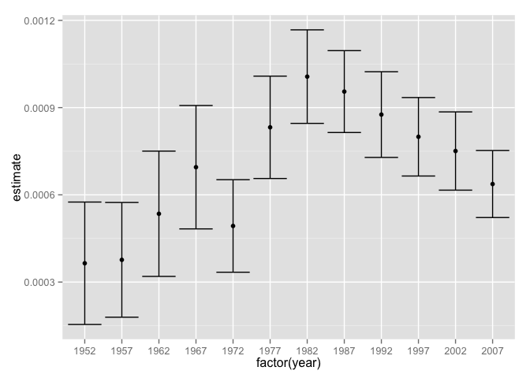

# Broom-lesson

Adapted from Will Hall's Broom lesson 

##Why *tidy* model objects?

`broom` aims to make objects from common statistical tools more useful by making them into *tidy* dataframes. 

Data is *tidy* if it is in a table that follows three rules: 

*  Each variable forms one column
*  Each observation forms one row
*  Each type of observational unit forms one table

Making model objects tidy allows the objects to be handed to other packages such as `dplyr` and `ggplot2` that are very useful for faciltating further exploration of your statistical model.  

To demonstrate how `broom` works I will use the `gampminder` package. The `gapminder` package provides a data set that has data on life expectancy, GDP per capita, and population by country from 1952 to 2007 in increments of 5 years.

Let's start by loading the packages that we will use today. 


```r
library(gapminder)
library(broom)
library(dplyr)
library(ggplot2)
```


```
##       country continent year lifeExp      pop gdpPercap
## 1 Afghanistan      Asia 1952  28.801  8425333  779.4453
## 2 Afghanistan      Asia 1957  30.332  9240934  820.8530
## 3 Afghanistan      Asia 1962  31.997 10267083  853.1007
## 4 Afghanistan      Asia 1967  34.020 11537966  836.1971
## 5 Afghanistan      Asia 1972  36.088 13079460  739.9811
## 6 Afghanistan      Asia 1977  38.438 14880372  786.1134
```

```
## Source: local data frame [1,704 x 6]
## 
##        country continent  year lifeExp      pop gdpPercap
##         (fctr)    (fctr) (int)   (dbl)    (int)     (dbl)
## 1  Afghanistan      Asia  1952  28.801  8425333  779.4453
## 2  Afghanistan      Asia  1957  30.332  9240934  820.8530
## 3  Afghanistan      Asia  1962  31.997 10267083  853.1007
## 4  Afghanistan      Asia  1967  34.020 11537966  836.1971
## 5  Afghanistan      Asia  1972  36.088 13079460  739.9811
## 6  Afghanistan      Asia  1977  38.438 14880372  786.1134
## 7  Afghanistan      Asia  1982  39.854 12881816  978.0114
## 8  Afghanistan      Asia  1987  40.822 13867957  852.3959
## 9  Afghanistan      Asia  1992  41.674 16317921  649.3414
## 10 Afghanistan      Asia  1997  41.763 22227415  635.3414
## ..         ...       ...   ...     ...      ...       ...
```

##Fitting a model

Imagine that we wanted to explore the relationship between life expectancy and GDP. To do so we can fit a linear regression using `lm()` in which life expectancy is predicted from GDP. Note, that throughout this lesson I will use `lm()` to demonstrate `broom`'s functionality; however, `broom` works with a number of other modeling functions. For a full list see the table at the end of this document. 


```r
fm <- lm(lifeExp ~ gdpPercap, data = gapminder)
```


##Exploring model outputs

Now that we have fit our model we want to explore the results. Start by taking a closer look at the fm object with r's `str()` function.

###base r functions


```r
str(fm)
```

```
## List of 12
##  $ coefficients : Named num [1:2] 5.40e+01 7.65e-04
##   ..- attr(*, "names")= chr [1:2] "(Intercept)" "gdpPercap"
##  $ residuals    : Named num [1:1704] -25.8 -24.3 -22.6 -20.6 -18.4 ...
##   ..- attr(*, "names")= chr [1:1704] "1" "2" "3" "4" ...
##  $ effects      : Named num [1:1704] -2455.1 311.1 -21.6 -19.6 -17.5 ...
##   ..- attr(*, "names")= chr [1:1704] "(Intercept)" "gdpPercap" "" "" ...
##  $ rank         : int 2
##  $ fitted.values: Named num [1:1704] 54.6 54.6 54.6 54.6 54.5 ...
##   ..- attr(*, "names")= chr [1:1704] "1" "2" "3" "4" ...
##  $ assign       : int [1:2] 0 1
##  $ qr           :List of 5
##   ..$ qr   : num [1:1704, 1:2] -41.2795 0.0242 0.0242 0.0242 0.0242 ...
##   .. ..- attr(*, "dimnames")=List of 2
##   .. .. ..$ : chr [1:1704] "1" "2" "3" "4" ...
##   .. .. ..$ : chr [1:2] "(Intercept)" "gdpPercap"
##   .. ..- attr(*, "assign")= int [1:2] 0 1
##   ..$ qraux: num [1:2] 1.02 1.02
##   ..$ pivot: int [1:2] 1 2
##   ..$ tol  : num 1e-07
##   ..$ rank : int 2
##   ..- attr(*, "class")= chr "qr"
##  $ df.residual  : int 1702
##  $ xlevels      : Named list()
##  $ call         : language lm(formula = lifeExp ~ gdpPercap, data = gapminder)
##  $ terms        :Classes 'terms', 'formula' length 3 lifeExp ~ gdpPercap
##   .. ..- attr(*, "variables")= language list(lifeExp, gdpPercap)
##   .. ..- attr(*, "factors")= int [1:2, 1] 0 1
##   .. .. ..- attr(*, "dimnames")=List of 2
##   .. .. .. ..$ : chr [1:2] "lifeExp" "gdpPercap"
##   .. .. .. ..$ : chr "gdpPercap"
##   .. ..- attr(*, "term.labels")= chr "gdpPercap"
##   .. ..- attr(*, "order")= int 1
##   .. ..- attr(*, "intercept")= int 1
##   .. ..- attr(*, "response")= int 1
##   .. ..- attr(*, ".Environment")=<environment: R_GlobalEnv> 
##   .. ..- attr(*, "predvars")= language list(lifeExp, gdpPercap)
##   .. ..- attr(*, "dataClasses")= Named chr [1:2] "numeric" "numeric"
##   .. .. ..- attr(*, "names")= chr [1:2] "lifeExp" "gdpPercap"
##  $ model        :'data.frame':	1704 obs. of  2 variables:
##   ..$ lifeExp  : num [1:1704] 28.8 30.3 32 34 36.1 ...
##   ..$ gdpPercap: num [1:1704] 779 821 853 836 740 ...
##   ..- attr(*, "terms")=Classes 'terms', 'formula' length 3 lifeExp ~ gdpPercap
##   .. .. ..- attr(*, "variables")= language list(lifeExp, gdpPercap)
##   .. .. ..- attr(*, "factors")= int [1:2, 1] 0 1
##   .. .. .. ..- attr(*, "dimnames")=List of 2
##   .. .. .. .. ..$ : chr [1:2] "lifeExp" "gdpPercap"
##   .. .. .. .. ..$ : chr "gdpPercap"
##   .. .. ..- attr(*, "term.labels")= chr "gdpPercap"
##   .. .. ..- attr(*, "order")= int 1
##   .. .. ..- attr(*, "intercept")= int 1
##   .. .. ..- attr(*, "response")= int 1
##   .. .. ..- attr(*, ".Environment")=<environment: R_GlobalEnv> 
##   .. .. ..- attr(*, "predvars")= language list(lifeExp, gdpPercap)
##   .. .. ..- attr(*, "dataClasses")= Named chr [1:2] "numeric" "numeric"
##   .. .. .. ..- attr(*, "names")= chr [1:2] "lifeExp" "gdpPercap"
##  - attr(*, "class")= chr "lm"
```

`str()` shows us that fm is a pretty impenetrable looking list. Lucky for us base r provides us with a number of useful helper functions that let us pull out information from the object returned by `lm()`.

First, the `summary()` function lets us take a look at the results of our model.


```r
summary(fm)
```

```
## 
## Call:
## lm(formula = lifeExp ~ gdpPercap, data = gapminder)
## 
## Residuals:
##     Min      1Q  Median      3Q     Max 
## -82.754  -7.758   2.176   8.225  18.426 
## 
## Coefficients:
##              Estimate Std. Error t value Pr(>|t|)    
## (Intercept) 5.396e+01  3.150e-01  171.29   <2e-16 ***
## gdpPercap   7.649e-04  2.579e-05   29.66   <2e-16 ***
## ---
## Signif. codes:  0 '***' 0.001 '**' 0.01 '*' 0.05 '.' 0.1 ' ' 1
## 
## Residual standard error: 10.49 on 1702 degrees of freedom
## Multiple R-squared:  0.3407,	Adjusted R-squared:  0.3403 
## F-statistic: 879.6 on 1 and 1702 DF,  p-value: < 2.2e-16
```

```
## 
## Call:
## lm(formula = lifeExp ~ gdpPercap, data = gapminder)
## 
## Residuals:
##     Min      1Q  Median      3Q     Max 
## -82.754  -7.758   2.176   8.225  18.426 
## 
## Coefficients:
##              Estimate Std. Error t value Pr(>|t|)    
## (Intercept) 5.396e+01  3.150e-01  171.29   <2e-16 ***
## gdpPercap   7.649e-04  2.579e-05   29.66   <2e-16 ***
## ---
## Signif. codes:  0 '***' 0.001 '**' 0.01 '*' 0.05 '.' 0.1 ' ' 1
## 
## Residual standard error: 10.49 on 1702 degrees of freedom
## Multiple R-squared:  0.3407,	Adjusted R-squared:  0.3403 
## F-statistic: 879.6 on 1 and 1702 DF,  p-value: < 2.2e-16
```

The `summary()` function has one very large drawback: information is printed to the screen rather than returned as an object. This makes it difficult to do subsequent data manipulation on the output returned by your model.

Based r provides other helper functions that try to overcome this problem. For example, the `coef()` function returns a vector of the estimated coefficients in your model. 


```r
coef(fm)
```

```
##  (Intercept)    gdpPercap 
## 5.395556e+01 7.648826e-04
```

```
##  (Intercept)    gdpPercap 
## 5.395556e+01 7.648826e-04
```

However, the information returned by `coef()` is pretty limited and needs to be combined with other base r helper functions to really tell you anything useful about the model that you fit. 

###broom()

`broom` provides a set of functions that tidy the messy output from a number of common modeling packages in order to facilitate exploration of your model output. 

`broom` provides three tidying functions: `tidy()`, `glance()`, and `augment()`. Each function takes messy model output and returns a dataframe. 


####tidy()

`tidy()` provides a statistical summary of your model as a dataframe. In a regression, tidy() provides coefficient estimates, standard errors, t statistics, and p-values. 


```r
tidy(fm)
```

```
##          term     estimate    std.error statistic       p.value
## 1 (Intercept) 5.395556e+01 3.149949e-01 171.29025  0.000000e+00
## 2   gdpPercap 7.648826e-04 2.579039e-05  29.65766 3.565724e-156
```

```
##          term     estimate    std.error statistic       p.value
## 1 (Intercept) 5.395556e+01 3.149949e-01 171.29025  0.000000e+00
## 2   gdpPercap 7.648826e-04 2.579039e-05  29.65766 3.565724e-156
```

####glance()

`glance()` gives you a one row dataframe that summarizes your model. Typically, `glance()` will give you a number of model fit indicators. 


```r
glance(fm)
```

```
##   r.squared adj.r.squared    sigma statistic       p.value df    logLik
## 1  0.340713     0.3403256 10.49132  879.5766 3.565724e-156  2 -6422.205
##        AIC      BIC deviance df.residual
## 1 12850.41 12866.73 187335.3        1702
```

```
##   r.squared adj.r.squared    sigma statistic       p.value df    logLik
## 1  0.340713     0.3403256 10.49132  879.5766 3.565724e-156  2 -6422.205
##        AIC      BIC deviance df.residual
## 1 12850.41 12866.73 187335.3        1702
```


####augment()

`augment()` provides observation level information about your model. In a regression, this includes predicted values, residuals, and indicators of outlying observations. 


```r
augment(fm) %>% head()
```

```
##   lifeExp gdpPercap  .fitted   .se.fit    .resid         .hat   .sigma
## 1  28.801  779.4453 54.55175 0.3035530 -25.75075 0.0008371608 10.47580
## 2  30.332  820.8530 54.58342 0.3029704 -24.25142 0.0008339503 10.47790
## 3  31.997  853.1007 54.60808 0.3025185 -22.61108 0.0008314644 10.48006
## 4  34.020  836.1971 54.59515 0.3027552 -20.57515 0.0008327659 10.48253
## 5  36.088  739.9811 54.52156 0.3041107 -18.43356 0.0008402399 10.48487
## 6  38.438  786.1134 54.55685 0.3034590 -16.11885 0.0008366424 10.48712
##        .cooksd .std.resid
## 1 0.0025259560  -2.455509
## 2 0.0022317673  -2.312534
## 3 0.0019342771  -2.156115
## 4 0.0016041410  -1.961977
## 5 0.0012991572  -1.757768
## 6 0.0009891099  -1.537041
```

```
##   lifeExp gdpPercap  .fitted   .se.fit    .resid         .hat   .sigma
## 1  28.801  779.4453 54.55175 0.3035530 -25.75075 0.0008371608 10.47580
## 2  30.332  820.8530 54.58342 0.3029704 -24.25142 0.0008339503 10.47790
## 3  31.997  853.1007 54.60808 0.3025185 -22.61108 0.0008314644 10.48006
## 4  34.020  836.1971 54.59515 0.3027552 -20.57515 0.0008327659 10.48253
## 5  36.088  739.9811 54.52156 0.3041107 -18.43356 0.0008402399 10.48487
## 6  38.438  786.1134 54.55685 0.3034590 -16.11885 0.0008366424 10.48712
##        .cooksd .std.resid
## 1 0.0025259560  -2.455509
## 2 0.0022317673  -2.312534
## 3 0.0019342771  -2.156115
## 4 0.0016041410  -1.961977
## 5 0.0012991572  -1.757768
## 6 0.0009891099  -1.537041
```


The important thing to note about `tidy()`, `glance()`, and `augment()` is that they return dataframes. Once you have your model output in a dataframe it is very easy to do further data exploration with tools like dplyr and `gpplot2`. 


```r
augment(fm) %>% class
```

```
## [1] "data.frame"
```

```
## [1] "data.frame"
```

For example, let's look at how well the model fits for observations with very low values for life expectancy. To do this we can use `dplyr`'s `filter()` function. 


```r
augment(fm) %>% filter(lifeExp < 30)
```

```
##   lifeExp gdpPercap  .fitted  .se.fit    .resid         .hat   .sigma
## 1  28.801  779.4453 54.55175 0.303553 -25.75075 0.0008371608 10.47580
## 2  23.599  737.0686 54.51933 0.304152 -30.92033 0.0008404679 10.46757
##       .cooksd .std.resid
## 1 0.002525956  -2.455509
## 2 0.003656365  -2.948469
```

###Challenge 1

Isolate rows of data in the model we fit that have standardized residuals +- 2.5 standard deviations from the mean (i.e outlying observations). For a bonus, try out the `augment_columns()` function to figure out which observations (i.e. country/year) these large residuals correspond to.   

##Fitting multiple models

###Using `dpylr`'s `group_by()` to fit many models

Imagine that you wanted to fit a regression model for each country in the gapminder dataset. To do this we would need to fit 142 different models!


We can do this quickly by combining dplyr’s `group_by()` and `do()` with broom's `tidy()` function. 


```r
mod1 <- 
gapminder %>% 
  group_by(country) %>% 
  do(tidy(lm(lifeExp ~ gdpPercap, data = .)))

mod1
```

```
## Source: local data frame [284 x 6]
## Groups: country [142]
## 
##        country        term     estimate    std.error  statistic
##         (fctr)       (chr)        (dbl)        (dbl)      (dbl)
## 1  Afghanistan (Intercept) 39.277201152 1.204623e+01  3.2605382
## 2  Afghanistan   gdpPercap -0.002240469 1.488416e-02 -0.1505271
## 3      Albania (Intercept) 53.981907401 3.164505e+00 17.0585624
## 4      Albania   gdpPercap  0.004439134 9.173196e-04  4.8392450
## 5      Algeria (Intercept) 27.440225117 4.896546e+00  5.6039956
## 6      Algeria   gdpPercap  0.007137315 1.064376e-03  6.7056340
## 7       Angola (Intercept) 41.614372628 3.911599e+00 10.6387116
## 8       Angola   gdpPercap -0.001034313 1.035945e-03 -0.9984247
## 9    Argentina (Intercept) 52.320078313 3.604117e+00 14.5167545
## 10   Argentina   gdpPercap  0.001869269 3.946958e-04  4.7359732
## ..         ...         ...          ...          ...        ...
## Variables not shown: p.value (dbl)
```

```
## Source: local data frame [284 x 6]
## Groups: country [142]
## 
##        country        term     estimate    std.error  statistic
##         (fctr)       (chr)        (dbl)        (dbl)      (dbl)
## 1  Afghanistan (Intercept) 39.277201152 1.204623e+01  3.2605382
## 2  Afghanistan   gdpPercap -0.002240469 1.488416e-02 -0.1505271
## 3      Albania (Intercept) 53.981907401 3.164505e+00 17.0585624
## 4      Albania   gdpPercap  0.004439134 9.173196e-04  4.8392450
## 5      Algeria (Intercept) 27.440225117 4.896546e+00  5.6039956
## 6      Algeria   gdpPercap  0.007137315 1.064376e-03  6.7056340
## 7       Angola (Intercept) 41.614372628 3.911599e+00 10.6387116
## 8       Angola   gdpPercap -0.001034313 1.035945e-03 -0.9984247
## 9    Argentina (Intercept) 52.320078313 3.604117e+00 14.5167545
## 10   Argentina   gdpPercap  0.001869269 3.946958e-04  4.7359732
## ..         ...         ...          ...          ...        ...
## Variables not shown: p.value (dbl)
```

###Filtering model outputs

We can then quickly isolate coefficients of interest using `dplyr`'s `filter()` function. 

For example, `filter()` lets you quickly isolate the coefficients for the relationship between life expectancy and GDP that were significantly different from zero.


```r
mod1 %>% 
  filter(term != "(Intercept)" & p.value <.05) %>% 
  ungroup %>% 
  arrange(-estimate)
```

```
## Source: local data frame [114 x 6]
## 
##         country      term   estimate   std.error statistic      p.value
##          (fctr)     (chr)      (dbl)       (dbl)     (dbl)        (dbl)
## 1         Nepal gdpPercap 0.05016213 0.003935138 12.747236 1.652038e-07
## 2        Guinea gdpPercap 0.04867788 0.009028327  5.391683 3.049939e-04
## 3      Ethiopia gdpPercap 0.04331400 0.012366870  3.502422 5.703383e-03
## 4          Mali gdpPercap 0.03536952 0.003373228 10.485364 1.027758e-06
## 5       Eritrea gdpPercap 0.03532369 0.006331148  5.579350 2.343187e-04
## 6  Burkina Faso gdpPercap 0.03290505 0.005568784  5.908839 1.492696e-04
## 7    Bangladesh gdpPercap 0.03254162 0.006449964  5.045240 5.027456e-04
## 8         Benin gdpPercap 0.03237919 0.006508148  4.975177 5.573822e-04
## 9        Malawi gdpPercap 0.03213895 0.006084274  5.282299 3.564668e-04
## 10     Tanzania gdpPercap 0.02361714 0.006376617  3.703709 4.083442e-03
## ..          ...       ...        ...         ...       ...          ...
```

```
## Source: local data frame [114 x 6]
## 
##         country      term   estimate   std.error statistic      p.value
##          (fctr)     (chr)      (dbl)       (dbl)     (dbl)        (dbl)
## 1         Nepal gdpPercap 0.05016213 0.003935138 12.747236 1.652038e-07
## 2        Guinea gdpPercap 0.04867788 0.009028327  5.391683 3.049939e-04
## 3      Ethiopia gdpPercap 0.04331400 0.012366870  3.502422 5.703383e-03
## 4          Mali gdpPercap 0.03536952 0.003373228 10.485364 1.027758e-06
## 5       Eritrea gdpPercap 0.03532369 0.006331148  5.579350 2.343187e-04
## 6  Burkina Faso gdpPercap 0.03290505 0.005568784  5.908839 1.492696e-04
## 7    Bangladesh gdpPercap 0.03254162 0.006449964  5.045240 5.027456e-04
## 8         Benin gdpPercap 0.03237919 0.006508148  4.975177 5.573822e-04
## 9        Malawi gdpPercap 0.03213895 0.006084274  5.282299 3.564668e-04
## 10     Tanzania gdpPercap 0.02361714 0.006376617  3.703709 4.083442e-03
## ..          ...       ...        ...         ...       ...          ...
```

###Adding confidence intervals

Finally, adding confidence intervals to the coefficient estimates returned by your model is made easy with broom's `tidy()` function. 


```r
gapminder %>% 
  group_by(country) %>% 
  do(tidy(lm(lifeExp ~ gdpPercap, data = .), conf.int = TRUE))
```

```
## Source: local data frame [284 x 8]
## Groups: country [142]
## 
##        country        term     estimate    std.error  statistic
##         (fctr)       (chr)        (dbl)        (dbl)      (dbl)
## 1  Afghanistan (Intercept) 39.277201152 1.204623e+01  3.2605382
## 2  Afghanistan   gdpPercap -0.002240469 1.488416e-02 -0.1505271
## 3      Albania (Intercept) 53.981907401 3.164505e+00 17.0585624
## 4      Albania   gdpPercap  0.004439134 9.173196e-04  4.8392450
## 5      Algeria (Intercept) 27.440225117 4.896546e+00  5.6039956
## 6      Algeria   gdpPercap  0.007137315 1.064376e-03  6.7056340
## 7       Angola (Intercept) 41.614372628 3.911599e+00 10.6387116
## 8       Angola   gdpPercap -0.001034313 1.035945e-03 -0.9984247
## 9    Argentina (Intercept) 52.320078313 3.604117e+00 14.5167545
## 10   Argentina   gdpPercap  0.001869269 3.946958e-04  4.7359732
## ..         ...         ...          ...          ...        ...
## Variables not shown: p.value (dbl), conf.low (dbl), conf.high (dbl)
```

```
## Source: local data frame [284 x 8]
## Groups: country [142]
## 
##        country        term     estimate    std.error  statistic
##         (fctr)       (chr)        (dbl)        (dbl)      (dbl)
## 1  Afghanistan (Intercept) 39.277201152 1.204623e+01  3.2605382
## 2  Afghanistan   gdpPercap -0.002240469 1.488416e-02 -0.1505271
## 3      Albania (Intercept) 53.981907401 3.164505e+00 17.0585624
## 4      Albania   gdpPercap  0.004439134 9.173196e-04  4.8392450
## 5      Algeria (Intercept) 27.440225117 4.896546e+00  5.6039956
## 6      Algeria   gdpPercap  0.007137315 1.064376e-03  6.7056340
## 7       Angola (Intercept) 41.614372628 3.911599e+00 10.6387116
## 8       Angola   gdpPercap -0.001034313 1.035945e-03 -0.9984247
## 9    Argentina (Intercept) 52.320078313 3.604117e+00 14.5167545
## 10   Argentina   gdpPercap  0.001869269 3.946958e-04  4.7359732
## ..         ...         ...          ...          ...        ...
## Variables not shown: p.value (dbl), conf.low (dbl), conf.high (dbl)
```

###Challenge 2

For each continent, find out how many countries have a non-significant relationship between life expectancy and GDP. 

##Visualizing model output

###Fit a model

Finally, combining `broom` and `ggplot2` makes it very easy to quickly visualize your model output. 

Imagine that you want to visualize the relationship between life expectancy and GDP across the last 60 years. You can do this with the gapminder data. Let's start by fitting separate models of the relationship between these two variable for each year that is in the gapminder dataset. Note, that we will ask `tidy()` to return confidence intervals as we will use them in our graph.


```r
my_results_to_viz <- 
  gapminder %>% 
  group_by(year) %>%
  do(tidy(lm(lifeExp ~ gdpPercap, data = .), conf.int =T))
```

###Visualize the model

Next, we will pipe the tidy dataframe returned by `tidy()` into `ggplot2`. 


```r
my_results_to_viz %>% 
filter(term != "(Intercept)") %>% 
  ggplot(aes(y = estimate, x = factor(year))) + geom_point() + 
  geom_errorbar(aes(ymin = conf.low, ymax = conf.high))
```

 


##Further reading

The author of broom() has an excellent [article](http://arxiv.org/abs/1412.3565) on arXiv that gives you a lot more detail about things you can do with broom().


##Table of objects that can be made tidy with broom*

Here is a table of the statistical objects supported by `broom`.


|package  |class                                                                                            |tidy |augment |glance |
|:--------|:------------------------------------------------------------------------------------------------|:----|:-------|:------|
|base     |data.frame                                                                                       |X    |X       |X      |
|base     |table                                                                                            |X    |NA      |NA     |
|stats    |anova, aov, density, ftable, manova, pairwise.htest, spec, ts, TukeyHSD                          |X    |NA      |NA     |
|stats    |kmeans, lm, nls                                                                                  |X    |X       |X      |
|stats    |smooth.spline                                                                                    |NA   |X       |X      |
|stats    |Arima, htest                                                                                     |X    |NA      |X      |
|stats    |loess                                                                                            |NA   |X       |NA     |
|stats    |glm                                                                                              |NA   |NA      |X      |
|bbmle    |mle2                                                                                             |X    |NA      |NA     |
|biglm    |biglm                                                                                            |X    |NA      |X      |
|binGroup |binDesign                                                                                        |X    |NA      |X      |
|binGroup |binWidth                                                                                         |X    |NA      |NA     |
|boot     |boot                                                                                             |X    |NA      |NA     |
|btergm   |btergm, roc                                                                                      |X    |NA      |NA     |
|ergm     |ergm                                                                                             |X    |NA      |X      |
|gam      |gam                                                                                              |X    |NA      |X      |
|gamlss   |gamlss                                                                                           |X    |NA      |NA     |
|geepack  |geeglm                                                                                           |X    |NA      |NA     |
|glmnet   |cv.glmnet, glmnet                                                                                |X    |NA      |X      |
|Hmisc    |rcorr                                                                                            |X    |NA      |NA     |
|lfe      |felm                                                                                             |X    |X       |X      |
|lme4     |merMod                                                                                           |X    |X       |X      |
|lmtest   |coeftest                                                                                         |X    |NA      |NA     |
|maps     |map                                                                                              |X    |NA      |NA     |
|MASS     |fitdistr, ridgelm                                                                                |X    |NA      |X      |
|MASS     |rlm                                                                                              |NA   |NA      |X      |
|multcomp |cld, confint.glht, glht, summary.glht                                                            |X    |NA      |NA     |
|nlme     |lme                                                                                              |X    |X       |X      |
|nnet     |multinom                                                                                         |X    |NA      |X      |
|plm      |plm                                                                                              |X    |X       |X      |
|sp       |Line, Lines, Polygon, Polygons, SpatialLinesDataFrame, SpatialPolygons, SpatialPolygonsDataFrame |X    |NA      |NA     |
|survival |aareg, cch, pyears, survexp, survfit                                                             |X    |NA      |X      |
|survival |coxph, survreg                                                                                   |X    |X       |X      |
|zoo      |zoo                                                                                              |X    |NA      |NA     |

*This table was made with code from `broom`'s author.

##Challenge solutions

### Challenge 1

Using `augment()` with `dplyr`'s filter() function you quickly isolate outlying data point in your model.


```r
augment(fm) %>% 
  filter(.std.resid < -2.5 | .std.resid > 2.5) %>% 
  arrange(.std.resid)
```

```
##   lifeExp   gdpPercap   .fitted   .se.fit    .resid         .hat   .sigma
## 1  58.033 113523.1329 140.78744 2.7534748 -82.75444 0.0688814119 10.28633
## 2  55.565 108382.3529 136.85534 2.6214866 -81.29034 0.0624360067 10.29509
## 3  67.712 109347.8670 137.59385 2.6462714 -69.88185 0.0636221874 10.34729
## 4  60.470  95458.1118 126.96981 2.2899636 -66.49981 0.0476427665 10.36352
## 5  64.624  80894.8833 115.83065 1.9171458 -51.20665 0.0333925907 10.41814
## 6  23.599    737.0686  54.51933 0.3041520 -30.92033 0.0008404679 10.46757
## 7  69.343  59265.4771  99.28670 1.3662412 -29.94370 0.0169587799 10.46882
## 8  30.015   3520.6103  56.64841 0.2714288 -26.63341 0.0006693477 10.47450
##       .cooksd .std.resid
## 1 2.471635551  -8.174453
## 2 2.132165959  -8.002182
## 3 1.609699997  -6.883491
## 4 1.055231853  -6.495168
## 5 0.425708663  -4.964451
## 6 0.003656365  -2.948469
## 7 0.071477900  -2.878654
## 8 0.002159717  -2.539465
```

`augment_columns()` is a more useful version of `augment()` as it adds the output of augment to the dataset that your model was fit.


```r
augment_columns(fm, data = gapminder) %>% 
  filter(.std.resid < -2.5 | .std.resid > 2.5) %>% 
  arrange(.std.resid)
```

```
##   country continent year lifeExp     pop   gdpPercap   .fitted   .se.fit
## 1  Kuwait      Asia 1957  58.033  212846 113523.1329 140.78744 2.7534748
## 2  Kuwait      Asia 1952  55.565  160000 108382.3529 136.85534 2.6214866
## 3  Kuwait      Asia 1972  67.712  841934 109347.8670 137.59385 2.6462714
## 4  Kuwait      Asia 1962  60.470  358266  95458.1118 126.96981 2.2899636
## 5  Kuwait      Asia 1967  64.624  575003  80894.8833 115.83065 1.9171458
## 6  Rwanda    Africa 1992  23.599 7290203    737.0686  54.51933 0.3041520
## 7  Kuwait      Asia 1977  69.343 1140357  59265.4771  99.28670 1.3662412
## 8  Angola    Africa 1952  30.015 4232095   3520.6103  56.64841 0.2714288
##      .resid         .hat   .sigma     .cooksd .std.resid
## 1 -82.75444 0.0688814119 10.28633 2.471635551  -8.174453
## 2 -81.29034 0.0624360067 10.29509 2.132165959  -8.002182
## 3 -69.88185 0.0636221874 10.34729 1.609699997  -6.883491
## 4 -66.49981 0.0476427665 10.36352 1.055231853  -6.495168
## 5 -51.20665 0.0333925907 10.41814 0.425708663  -4.964451
## 6 -30.92033 0.0008404679 10.46757 0.003656365  -2.948469
## 7 -29.94370 0.0169587799 10.46882 0.071477900  -2.878654
## 8 -26.63341 0.0006693477 10.47450 0.002159717  -2.539465
```


### Challenge 2 

Using `tidy()` in combination with `dplyr` you can easily isolate coefficients with p values greater than .05. Then employing `dplyr`'s `summarise()` function allows you to count up how many coefficients meet this criteria. 


```r
gapminder %>%  
  group_by(continent, country) %>% 
  do(tidy(lm(lifeExp ~ gdpPercap, data = .))) %>% 
  filter(term !="(Intercept)" & p.value >.05) %>% 
  group_by(continent) %>% 
  summarise(n_count = n())
```

```
## Source: local data frame [3 x 2]
## 
##   continent n_count
##      (fctr)   (int)
## 1    Africa      22
## 2  Americas       3
## 3      Asia       3
```

```
## Source: local data frame [3 x 2]
## 
##   continent n_count
##      (fctr)   (int)
## 1    Africa      22
## 2  Americas       3
## 3      Asia       3
```
